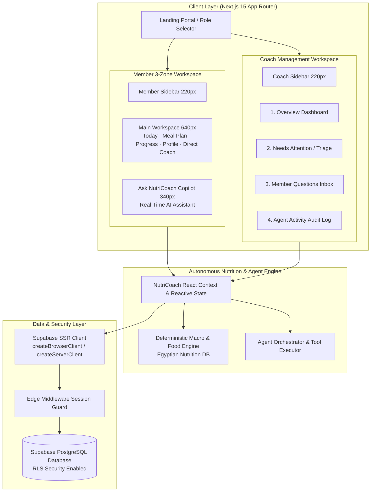
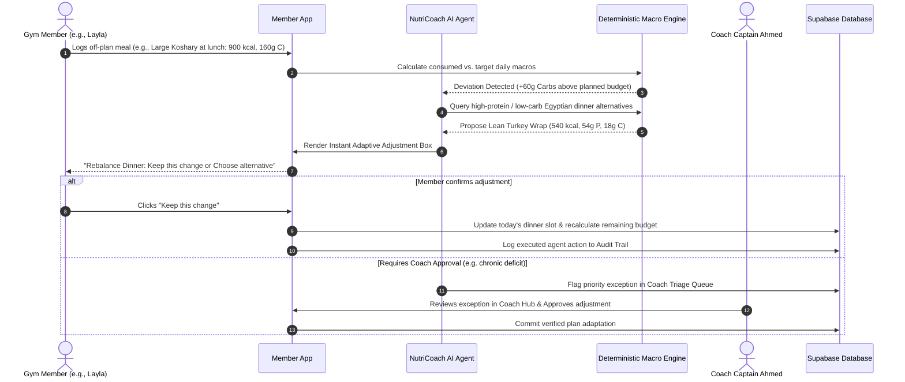
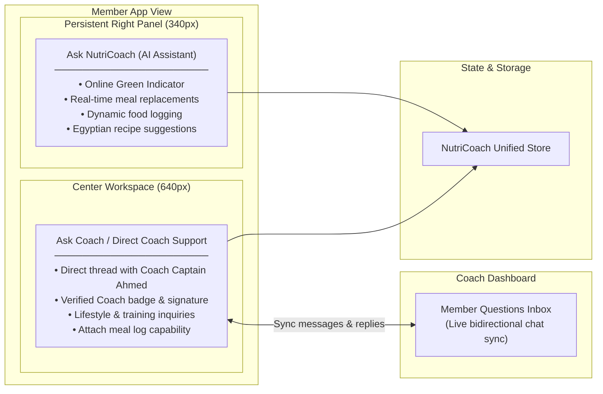

# NutriCoach 🥑⚡
### Adaptive AI Nutrition Operations Agent for Gyms

[](https://nextjs.org/)
[](https://supabase.com/)
[](https://www.typescriptlang.org/)
[](https://tailwindcss.com/)

---

## 📌 Executive Overview

**NutriCoach** is an adaptive AI nutrition operations platform engineered for modern gyms and fitness clubs. 

Traditional gym nutrition subscriptions deliver static PDF meal plans that fail the moment a member eats off-plan or misses a day. **NutriCoach solves this by continuously adapting the member's daily nutrition plan based on what they actually eat, their adherence, and personal goals—while keeping human coaches in control of exceptions.**

```
       ┌────────────────────────────────────────────────────────┐
       │                   NutriCoach Gateway                   │
       └───────────────────────────┬────────────────────────────┘
                                   │
                ┌──────────────────┴──────────────────┐
                ▼                                     ▼
     ┌──────────────────────┐              ┌──────────────────────┐
     │  Member Experience   │              │   Coach Workspace    │
     │  (Athletes & Clients)│              │  (Trainers & Staff)  │
     └──────────────────────┘              └──────────────────────┘
```

---

## 🏛️ System Architecture Diagrams

### 1. Dual-Experience System Topology



---

### 2. Autonomous Nutrition Rebalancing Flow



---

### 3. Chat Architecture: AI Copilot vs. Human Coach Channel



---

## 🌟 Core Features & Modules

### 1. Member Experience (3-Zone Clean Architecture)
- **Left Sidebar (220px)**: Fast routing between **Today**, **Meal Plan**, **Progress**, **Ask Coach**, and **Profile**.
- **Center Workspace (~640px Flexible)**:
  - **Flat Macro Summary Row**: Live calorie gauge, protein, carbs, and fats progress bars.
  - **Curated Editorial Tip**: Personalized science-backed nutrition guides based on active persona.
  - **Adaptive AI Adjustment Box**: Visual before/after meal rebalancing diff cards.
  - **Meals Stream**: Expandable cards for Breakfast, Lunch, Snacks, Dinner + Custom logged foods.
  - **Direct Coach Messaging**: 1-on-1 direct channel with Coach Captain Ahmed.
- **Right Panel (340px Fixed)**: Persistent **Ask NutriCoach** AI Copilot for immediate calculations, substitutions, and Egyptian recipe generation.

### 2. Coach Workspace (4 Primary Workflows)
1. **Overview Dashboard**: Team consistency diagram (7-day aggregate compliance bar chart), active athlete counters, and triage summary list.
2. **Needs Attention / Triage**: Priority queue flagging behavioral deviations, protein gaps, and member inactivity with 1-click app inspection.
3. **Member Questions**: Live bidirectional coaching inbox with pre-populated fast-response templates.
4. **Agent Activity Log**: Verifiable audit trail recording tool invocations, manual vs. agent time benchmarks, and net minutes saved.

### 3. Deterministic Egyptian Nutrition Engine
- Mathematically verified macro calculations ($\text{Calories} = 4P + 4C + 9F$).
- Pre-loaded database of authentic Egyptian meals (Ful medames with baladi bread, Koshary, Grilled sea bass, Molokhia with rice, Lean beef kofta, Shish taouk, and Greek yogurt bowls).

---

## 👥 6 Interactive Demo Personas

| # | Persona | Scenario | Description |
|---|---|---|---|
| **1** | **Omar Hassan** | `Stable` | 100% adherence streak. Hypertrophy focus (2,450 kcal / 160g P). |
| **2** | **Sara El-Masry** | `Single Miss` | Missed dinner due to late flight. Demonstrates anti-overcompensation logic. |
| **3** | **Layla Mostafa** | `Deviation` | Logged Koshary for lunch. Triggers instant dinner rebalance proposal. |
| **4** | **Ahmed Nabil** | `Protein Gap` | Consistent calories but low protein. Demonstrates weekly snack upgrade. |
| **5** | **Mariam Farouk**| `Shift` | Pescatarian transition. Demonstrates ingredient filter (`no meat/chicken`). |
| **6** | **Youssef Adel** | `Inactive` | 4 days without logging. Triggers proactive coach check-in message. |

---

## 💻 Tech Stack

- **Framework**: [Next.js 15](https://nextjs.org/) (App Router, Server Actions, Edge Middleware)
- **Database & Auth**: [Supabase](https://supabase.com/) with PostgreSQL, Row Level Security (RLS), and `@supabase/ssr`
- **Language**: [TypeScript 5](https://www.typescriptlang.org/) (Strict mode, zero `any`)
- **Styling**: [Tailwind CSS](https://tailwindcss.com/) with curated warm modern aesthetic (`#F9F9F7` canvas, sage green `#4C7C44` brand accents)
- **Icons**: [Lucide React](https://lucide.dev/)
- **AI Agent Engine**: Google Gemini API integration with local deterministic rule-based fallback

---

## 🚀 Quickstart & Installation

### 1. Clone the Repository
```bash
git clone https://github.com/Kholoud-Alsaady/nutricoach-app.git
cd nutricoach-app
```

### 2. Install Dependencies
```bash
npm install
```

### 3. Configure Environment Variables
Create `.env.local` in the project root:
```env
NEXT_PUBLIC_SUPABASE_URL=https://YOUR_PROJECT_ID.supabase.co
NEXT_PUBLIC_SUPABASE_PUBLISHABLE_KEY=your-publishable-key
NEXT_PUBLIC_SUPABASE_ANON_KEY=your-anon-key

# Server-only (for seed scripts)
SUPABASE_SERVICE_ROLE_KEY=your-service-role-key

# Optional: Google Gemini API Key
GEMINI_API_KEY=
GEMINI_MODEL=gemini-3.5-flash-lite

NEXT_PUBLIC_DEMO_MODE=true
```

### 4. Database Setup & Seeding
```bash
# 1. Apply Database Schema (or run supabase/schema.sql in Supabase SQL editor)
npm run db:setup

# 2. Seed Demo Members & Plans
npm run seed
```

### 5. Run Development Server
```bash
npm run dev
```

Open [http://localhost:3000](http://localhost:3000) in your browser.

---

## 🧪 Validation & Type Checking

```bash
# Run TypeScript compilation check
npm run typecheck

# Run Next.js production build
npm run build
```

---

## 📄 License
MIT © 2026 NutriCoach Team. Built for the Egyptian AI Agent Competition.
