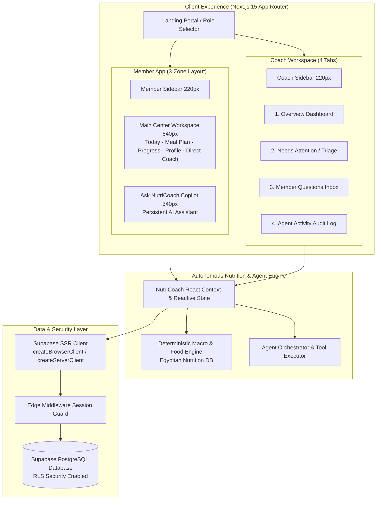
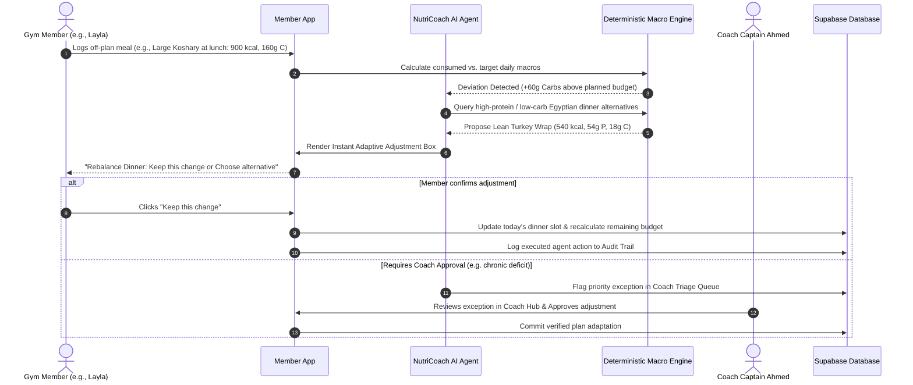
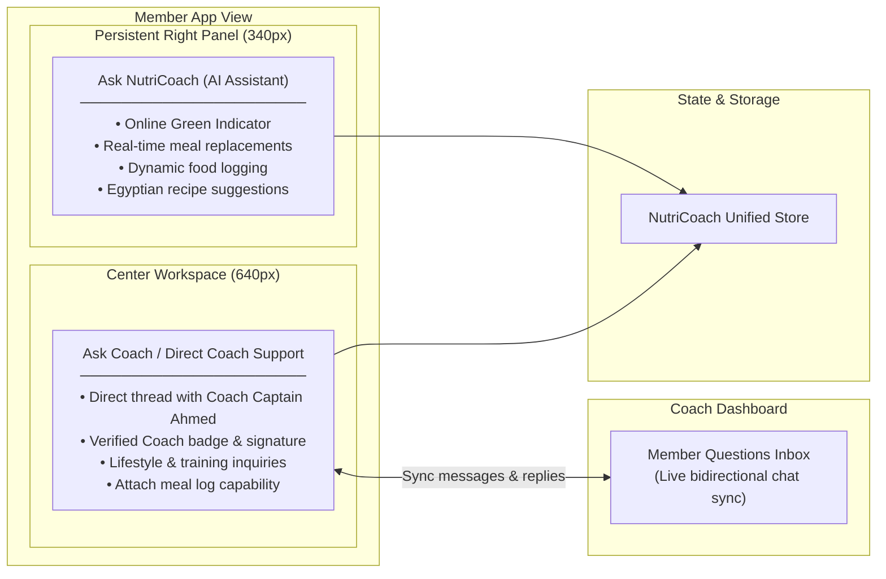

# NutriCoach

> **Live Application**: [NutriCoach — Adaptive AI Nutrition for Gyms](https://nutricoach-app-gray.vercel.app/)

NutriCoach is an adaptive AI nutrition platform built for gym athletes and coaches. Instead of static, inflexible meal plans, NutriCoach continuously adapts daily nutrition targets based on what members actually eat, while keeping coaches in control of exceptions.

---

## 🏛️ Architecture Diagrams

### 1. System Topology & Dual Experiences

### 2. Autonomous Nutrition Rebalancing Flow

### 3. Chat Architecture: AI Copilot vs. Human Coach Channel

---

## 📱 Two Distinct Interfaces

### 1. Member App (3-Zone Clean Workspace)
- **Navigation Sidebar (220px)**: Quick switching between Daily Tracking, Meal Planner, Adherence Trends, Coach Direct Line, and Profile.
- **Center Workspace (640px)**:
  - **Macro Summary & Gauges**: Real-time calorie and macronutrient balance.
  - **Adaptive Before/After Box**: Immediate visual diff when meals deviate.
  - **Meals Stream**: Interactive logging with portion adjustments.
  - **Direct Coach Support**: 1-on-1 private messaging channel with assigned human coach (Coach Captain Ahmed).
- **Persistent AI Panel (340px)**: **Ask NutriCoach** copilot for quick Egyptian recipe recommendations, calorie calculations, and meal swaps.

### 2. Coach Workspace (4 Primary Workflows)
- **Overview Dashboard**: Team compliance trends, 7-day adherence charts, and aggregate consistency metrics.
- **Needs Attention / Triage**: Priority worklist flagging deviations, protein gaps, and member inactivity for coach intervention.
- **Member Questions Inbox**: Direct communication desk to read and answer incoming athlete inquiries.
- **Agent Activity Log**: Verifiable audit trail showing automated plan adjustments and coach time saved.

---

## ⚡ Core Features

- **Autonomous Meal Rebalancing**: Automatically recalculates dinner and snacks when lunch deviates from target macros.
- **Deterministic Macro Verification**: Calorie calculations are mathematically verified ($P \times 4 + C \times 4 + F \times 9$).
- **Egyptian Food Intelligence**: Built-in authentic Egyptian database (Ful medames, Koshary, Grilled sea bass, Molokhia, Kofta, Shish taouk, Greek yogurt bowls).
- **Separated Chat Architecture**: Dedicated 1-on-1 Human Coach Inbox cleanly separated from the persistent real-time AI Assistant.
- **Interactive Personas**: 6 pre-configured member scenarios demonstrating stable streaks, missed logs, carbohydrate deviations, protein gaps, dietary shifts, and inactivity alerts.

---

## 🛠️ Tech Stack

- **Frontend**: Next.js 15 (App Router, Server & Client Components)
- **Backend & Database**: Supabase PostgreSQL with Row Level Security (RLS) & SSR
- **Language & Styling**: TypeScript, Tailwind CSS, Lucide Icons
- **AI Engine**: Google Gemini API with deterministic rule-based fallback
