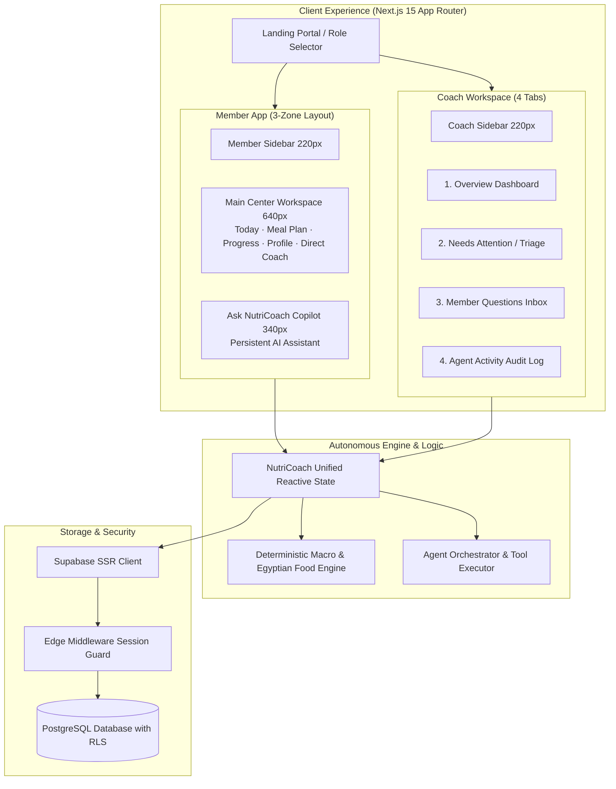
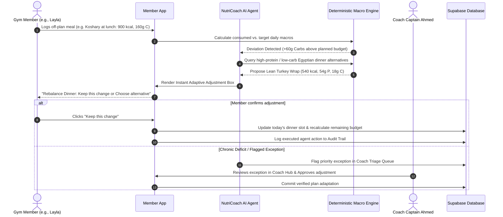
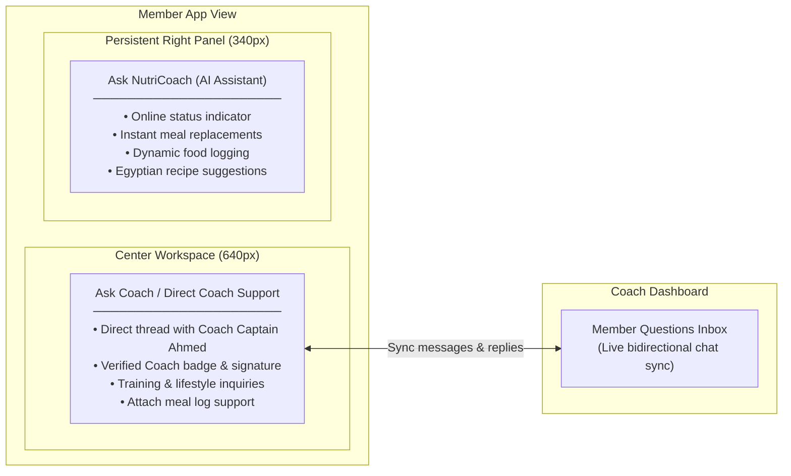

# NutriCoach

> **Live Application**: [NutriCoach — Adaptive AI Nutrition for Gyms](https://nutricoach-app-gray.vercel.app/)

NutriCoach is an adaptive AI nutrition platform designed for gym athletes and coaches. Instead of static meal plans, NutriCoach continuously adapts daily nutrition targets based on what members actually eat, while keeping coaches in control of exceptions.

---

## 🏛️ Architecture Diagrams

### 1. System Topology & Dual Experiences



---

### 2. Autonomous Adaptation & Rebalancing Flow



---

### 3. Chat Architecture: Persistent AI Copilot vs. Human Coach Channel



---

## 🌟 Key Features

- **3-Zone Member Experience**: Sidebar navigation, flexible center workspace (Macro summary, Curated guides, Adaptive before/after box, Meals stream, and Direct Coach Messaging), and persistent **Ask NutriCoach** AI assistant.
- **Coach Hub Workflows**: Overview dashboard with 7-day adherence charts, priority triage queue, member messaging inbox, and autonomous agent audit log.
- **Deterministic Egyptian Macro Engine**: Mathematical calorie verification ($P \times 4 + C \times 4 + F \times 9$) and authentic Egyptian food database (Ful medames, Koshary, Grilled sea bass, Molokhia, Kofta, Shish taouk, and Greek yogurt bowls).

---

## 👥 Demo Personas

1. **Omar Hassan** — *Consistent Progress*: 100% adherence streak, hypertrophy targets (2,450 kcal / 160g protein).
2. **Sara El-Masry** — *Single Miss*: Missed dinner due to late flight; demonstrates anti-overcompensation logic.
3. **Layla Mostafa** — *Repeated Deviation*: Logged off-plan lunch; triggers instant dinner rebalancing.
4. **Ahmed Nabil** — *Protein Gap*: Hits calorie goal but falls short on protein; triggers high-protein snack upgrades.
5. **Mariam Farouk** — *Dietary Shift*: Pescatarian transition; filters out poultry/meat while meeting protein targets.
6. **Youssef Adel** — *Inactivity Alert*: 4 days without logging; triggers proactive coach check-in.

---

## 💻 Tech Stack

- **Framework**: Next.js 15 (App Router, Server & Client Components)
- **Database & Auth**: Supabase PostgreSQL with Row Level Security (RLS) & SSR
- **Language & Styling**: TypeScript 5, Tailwind CSS, Lucide Icons
- **AI Agent**: Google Gemini API with local deterministic fallback

---

## 🚀 Local Setup

```bash
# 1. Install dependencies
npm install

# 2. Configure environment in .env.local
NEXT_PUBLIC_SUPABASE_URL=https://YOUR_PROJECT.supabase.co
NEXT_PUBLIC_SUPABASE_PUBLISHABLE_KEY=your-publishable-key
NEXT_PUBLIC_SUPABASE_ANON_KEY=your-anon-key
SUPABASE_SERVICE_ROLE_KEY=your-service-role-key

# 3. Seed initial demo personas and plans
npm run seed

# 4. Start local development server
npm run dev
```
